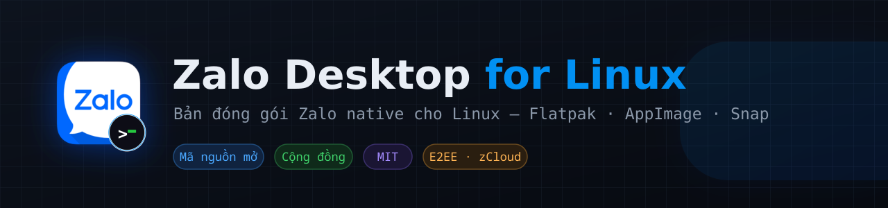

<p align="center">
  
</p>

<p align="center">
  
  
  
  
  
  
</p>

# Zalo Desktop cho Linux

Zalo chạy **native** trên Linux — không Wine, không trình duyệt. Ghép app Zalo
chính thức (bản macOS) với phần native Linux, vá lại cho chạy đúng, rồi đóng gói
**Flatpak · AppImage · Snap**. Vẫn là mã Zalo gốc, chỉ bù những mảnh Zalo chưa
phát hành cho Linux.

## Tính năng

- ✅ Tin nhắn **mã hoá đầu-cuối (E2EE)** + đồng bộ **zCloud**
- ✅ Xem lại **ảnh/video/file cũ** (tới tận 2019)
- ✅ **Thu nhỏ khay**, đóng/thoát, cửa sổ xem media có nút X — đúng chuẩn Linux
- ✅ Thumbnail video, khung cửa sổ gọn gàng
- ⛔ **Chưa có gọi thoại/video** — engine gọi của Zalo chỉ có bản macOS/Windows

## Cài đặt / Cập nhập 

**Một dòng lệnh** — tự chọn Flatpak/AppImage/Snap tuỳ máy bạn có gì:

```bash
curl -fsSL https://raw.githubusercontent.com/Crust92/ZaloDesktopLinux/main/install.sh | bash
```

Script tải gói từ Releases, **đối chiếu SHA256**, cài vào thư mục người dùng
(không cần root, trừ Snap). Chọn cách cài cụ thể: `... | bash -s -- --method appimage`.
Gỡ: `... | bash -s -- --uninstall`.

> Quen kiểm tra trước khi chạy? Tải về đọc rồi hãy chạy:
> `curl -fsSLO .../install.sh && less install.sh && bash install.sh`

**Snap** — tự cập nhật:

```bash
sudo snap install --edge zalo-desktop
```

Hoặc tải gói thủ công ở [Releases](https://github.com/Crust92/ZaloDesktopLinux/releases):

```bash
# Flatpak (khuyên dùng cho Fedora/Arch/openSUSE)
flatpak install --user ./ZaloDesktop-*-x86_64.flatpak

# AppImage (chạy luôn, không cần cài)
chmod +x ZaloDesktop-*-x86_64.AppImage && ./ZaloDesktop-*-x86_64.AppImage
```

## Dựng từ mã nguồn

Repo **không chứa binary** — tải nguồn trước rồi dựng:

```bash
./fetch-sources.sh   # lấy .dmg macOS + Electron + snap
./build.sh --from-source
```

Đã có `stage/` thì `./build.sh` dựng lại nhanh. Kiểm bản vá không dựng: `./build.sh --check`.

## Hồ sơ bản vá

Có **13 bản vá** (P1–P13) bù phần nền tảng và bật lại tính năng Zalo tắt cho Linux.
Chọn bằng `--profile=`:

| Hồ sơ | Gồm | Dùng khi |
|---|---|---|
| `compat` | P1, P5 | Chỉ đủ để chạy, không đổi hành vi. Đánh đổi: không xem được media cũ. |
| `default` | P1–P7, P9–P13 | Bật lại mặc định của chính Zalo bị máy chủ tắt cho Linux. |
| `full` | + P8 | Thêm khai client Windows để mở khoá **E2EE/zCloud**. |

> 📖 Toàn bộ chi tiết từng bản vá, hai kho media, hiệu năng, đưa lên store:
> **[docs/KY-THUAT.md](docs/KY-THUAT.md)**

## Chạy

```bash
flatpak run ac.d3v.ZaloLinux
```

App thoát ngay không log? `rm -f ~/.var/app/ac.d3v.ZaloLinux/config/ZaloData/Singleton*`

## Đóng góp

Issue và pull request đều được chào đón. Đây là dự án cộng đồng — một ⭐ cũng là động lực.

---

*Dự án cộng đồng phi lợi nhuận, **không liên kết với VNG/Zalo**. "Zalo" là thương
hiệu của VNG; dự án chỉ đóng gói lại để dùng trên Linux, cho mục đích cá nhân.
Giấy phép [MIT](LICENSE).*
